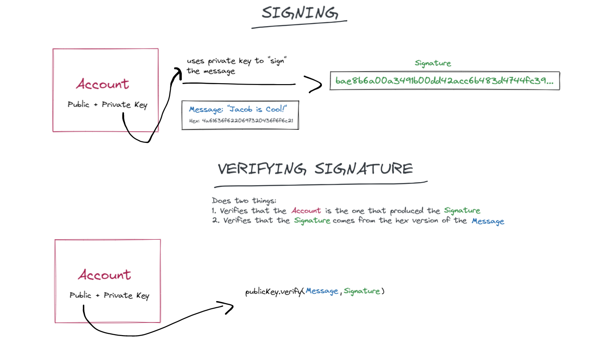

# Sign & Verify Message on a Backend (Flow)

This is an example of how to sign a custom message using a non-custodial wallet (meaning you have the private key). Then, we take the signature and verify it on-chain. 

Here is a helpful image to describe what is going on here:

